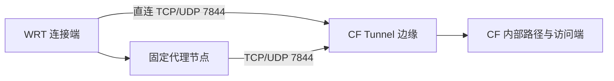

# Cloudflare Tunnel：被穿透端到边缘网络

配置交互更新：默认DIRECT保持，用户现可在Tunnel分组内主动选择现有机场自动链、地区链、共享家宽或实际节点。自动链复用网页探针，不代表本报告已经验证其7844/QUIC健康判断；选择权交给用户，规则仍限定原Tunnel端点与端口。

日期：2026-09-11。目标：混合使用，稳定性优先。设备为 `172.16.199.1`，OpenClash、MosDNS、cloudflared 同机运行。

**本轮保留 DIRECT 默认，不增加自动测速或机场回退。最有把握的配置修复是让两个 region 保留真实地址池，解除 Fake-IP 导致的两连接上限。** 日本 HY2 在成功样本中更快，但交错复测出现超时，尚不足以替换直连。两份候选已修复 DNS；生产配置未部署、服务未重启，实际仍为两条 HTTP/2 连接。

## 1. 真机确认的问题

| 项目 | 实际状态 |
|---|---|
| cloudflared | 2026.7.3，运行时 Go 1.27.0，`--protocol auto` |
| Mihomo | `alpha-ge183c58`，Go 1.26.5；本地回归使用官方 v1.19.30 |
| 系统解析链 | dnsmasq → MosDNS 5335 → Mihomo 7874 |
| region1 / region2 | 系统分别返回 `198.18.0.10` / `198.18.0.58`，每个域名仅一个地址 |
| 生产连接 | 两条 HTTP/2，域名规则 DIRECT，CF 位置 `lax12`、`sjc11` |
| 实际 HA 指标 | `cloudflared_tunnel_ha_connections 2` |

当前 cloudflared 的日志明确记录请求四条连接、最多只能提供两条。官方源码会用发现的地址数限制 HA 数；每个 region 被压成一个 Fake-IP，两个地址合计使上限降为二。这是地址池与冗余问题，并非单纯的面板显示差异。[2026.7.3 HA 限制实现](https://github.com/cloudflare/cloudflared/blob/2026.7.3/supervisor/supervisor.go#L209)

必须把它与历史 QUIC 超时分开：

- 当前 cloudflared 于 **09:21:03 UTC** 启动，09:23:10 回退 HTTP/2；更早的旧进程也有 QUIC 失败记录。
- 当前 Mihomo 进程于 **10:52:06 UTC** 启动；cloudflared 于 10:52:26/27 注册 HTTP/2 成功。
- 本轮用生产 SNI 测试，原始直连、生产 TUN Fake-IP、生产 SOCKS Fake-IP 各两个目标，QUIC 均握手成功。

这些时间与“早期连接失败，后续继续使用回退协议”相容，但没有证明此前没有其他核心或启动顺序是唯一原因。**不能据旧日志认定当前 UDP 7844 不通，也不能声称本次 DNS 修复已解决历史 QUIC 故障。**

## 2. 对照方法与结果

测试只比较 `cloudflared → Cloudflare Tunnel 边缘`：



在 WRT `/tmp` 启动独立 Mihomo，仅监听回环；关闭订阅更新、节点健康检查，读取现有提供器的本地副本。临时核心及原始直连探测使用 GID 65534，按现有 OpenClash OUTPUT 规则绕过生产透明接管。节点凭据始终留在 WRT，测试结束删除临时副本。生产业务选择器未切换。

探测器使用官方 cloudflared 2026.7.3 源码与 vendor 的 CA、TLS 曲线及 QUIC 设置，通过 SOCKS5 CONNECT / UDP ASSOCIATE 固定两个地址：`198.41.192.7:7844`、`198.41.200.233:7844`，分别取两个 region 的地址。超时五秒，不发送凭据、不注册 Tunnel、不创建公开 Quick Tunnel。

先用官方 `probe.cftunnel.com` 预检 SNI 筛选 14 个固定节点并交错插入 DIRECT；再对少量候选使用生产 SNI `quic.cftunnel.com` / `h2.cftunnel.com`，五轮交替正反顺序。后者每路径、每协议各十次，结果如下。耗时列为**成功样本中位数 / 最大值**，超时不混入中位数，必须同时看成功次数：

| 路径 | QUIC：成功次数；耗时 | TCP+TLS：成功次数；耗时 |
|---|---|---|
| DIRECT | 10/10；194 / 203 ms | 10/10；378 / 384 ms |
| 机场名称3·日本HY2 | 9/10；87 / 1087 ms | 10/10；231 / 655 ms |
| 机场名称3·香港HY2 | 10/10；318 / 1730 ms | 9/10；186 / 1138 ms |
| 机场名称1·香港 | 1/10；323 / 323 ms | 0/10；— |

- 直连这五轮 QUIC 为 184.7–203.2 ms，两个协议均无握手失败。它在该复测窗口中更平稳，保留默认有依据；初筛也曾出现 QUIC 0.39 秒、TCP/TLS 1.60 秒的成功握手，不能据后五轮否认更早的波动。
- 日本 HY2 的低中位数没有计入一次五秒 QUIC 超时；TCP/TLS 虽全部成功，波动也大于直连。可作为后续有负载测试的候选，不自动提升为默认。
- 香港 HY2 的 TCP/TLS 有一次五秒超时；香港 VLESS 反复 EOF/QUIC 超时，不适合作为本轮默认。
- 对香港 VLESS 补做 Go 1.27.1 / 1.26.5、预检 / 生产 SNI 交叉对照，TCP/TLS 均 EOF，QUIC 成败有波动。未定位根因，不将失败泛化为整个机场或所有 VLESS，也不归因于 PQ、ALPN 或某个 Go 版本。

初筛覆盖如下。每格仅两个目标的一轮，使用预检 SNI，**不能与上面的生产 SNI 复测混为同一排名**：

| 代表节点 | QUIC 成功 | TCP+TLS 成功 |
|---|---|---|
| 机场名称1·香港 | 2/2 | 0/2 |
| 机场名称1·日本 | 1/2 | 0/2 |
| 机场名称1·新加坡 | 2/2 | 0/2 |
| 机场名称1·美国 | 1/2 | 0/2 |
| 机场名称1·台湾 | 2/2 | 0/2 |
| 机场名称3·香港VLESS | 2/2 | 0/2 |
| 机场名称3·日本VLESS | 1/2 | 0/2 |
| 机场名称3·新加坡VLESS | 0/2 | 0/2 |
| 机场名称3·美国VLESS | 2/2 | 0/2 |
| 机场名称3·香港HY2 | 1/2 | 2/2 |
| 机场名称3·日本HY2 | 2/2 | 2/2 |
| 机场名称3·新加坡HY2 | 0/2 | 1/2 |
| 机场名称4·德国 | 2/2 | 2/2 |
| 机场名称4·阿里云 | 0/2 | 0/2 |

全部探测共 188 次握手，涵盖原始直连 / 临时 SOCKS 对照、14 节点初筛、生产接管路径、五轮复测和 TLS 版本对照；时间约 11:12–11:21 UTC。实际节点全名、逐条时间、失败原因、工具版本与摘要见[本轮脱敏证据](/tmp/rules-tunnel-live-oiak1rpu)。这不是对所有 89 个节点的穷举。机场名称1/3/4分别对应设备现有 YKK_Cloud、良心云、Self_Back 提供器；机场名称2尚不存在。

### 结果边界

`http2` 是工具中的协议选择标签，本次实际只测 TCP+TLS，未发送 HTTP/2 注册或业务帧。QUIC 也只验证握手；早期对预检 SNI 探索三秒保持窗口时，远端正常关闭未注册连接，不能把它算作网络断流。QUIC 指标更新次数不是独立 RTT 样本，丢包计数也不能当作有业务分母的丢包率。

本轮未测持续注册连接的重连率、混合负载吞吐、业务 p95 或高峰期长时间可用性；成功握手不能证明这些指标。两个地址是 Anycast，固定字面量不保证不同出口抵达同一机房。代理自身连接可复用，首次与后续建连耗时也会不同。**结论是当前证据支持的默认选择，不是全天“最佳线路”的承诺。** [官方预检实现](https://github.com/cloudflare/cloudflared/blob/2026.7.3/prechecks/probes.go)

## 3. 配置中的最小修复

两份候选仅新增以下 DNS 例外：

```yaml
fake-ip-filter:
  - "DOMAIN,region1.v2.argotunnel.com,real-ip"
  - "DOMAIN,region2.v2.argotunnel.com,real-ip"
  # 原有规则继续放在后面
nameserver-policy:
  "+.argotunnel.com":
    - "https://dns.alidns.com/dns-query#DIRECT"
    - "https://doh.pub/dns-query#DIRECT"
```

这里只展示增量，不能用片段覆盖整个 `dns`。真实 IP 例外严格限于两个 region；`+.argotunnel.com` 的 DNS policy 复用既有父域 DIRECT 意图，同时覆盖启动发现的 SRV 和功能 TXT，避免列五个重复键。SRV/TXT 本来不会获得 Fake-IP，无需再加过滤规则；`cftunnel.com` 的 TLS SNI 不等于必须扩大真实 IP 例外。 [Mihomo DNS](https://wiki.metacubex.one/config/dns/)、[cloudflared 地址发现](https://github.com/cloudflare/cloudflared/blob/2026.7.3/edgediscovery/allregions/discovery.go)

已在 WRT 同版本的临时核心验证：两个 region **各返回十个真实 IPv4**，AAAA 仍为空，`other.argotunnel.com` 仍返回 Fake-IP。生产系统 DNS 未改，仍返回原 Fake-IP。因此已验证修复与实际核心兼容，**尚未验证生产 connector 重建后四条注册连接的结果**。

### 配套分流保持精确

此前已给两候选加入 `Cloudflare Tunnel` select：默认 DIRECT，其余为真实节点。范围限 TCP/UDP 7844，加五个精确域名或官方全球二十 IPv4、二十 IPv6 的 `/32`、`/128` 清单。没有域名的真实 IP 也必须命中同一入口；不能只依赖可能缺失或被覆盖的 DNS 反向映射。

Mihomo 会跳过不支持 UDP 的代理并继续匹配，因此同条件 REJECT 兜底必须保留，避免手选节点失效后悄悄漏回其他出口。443、普通 CF 网站、`trycloudflare.com` 和明确国内直连保持原分流；全局及 DNS IPv6 仍关闭。当前三/四机场各 31 个可见 select，总组数 110/145，规则 131 条，规则 provider 93 个。[端点与端口](https://developers.cloudflare.com/cloudflare-one/networks/connectors/cloudflare-tunnel/configure-tunnels/tunnel-with-firewall/)、[Mihomo UDP 规则行为](https://wiki.metacubex.one/config/rules/)

## 4. 为什么继续保持简单

- Tunnel 默认 DIRECT，`cloudflared --protocol auto` 保留。现有证据不支持固定 HTTP/2，也不支持强制 QUIC 而放弃协议回退。
- 代理仍是独立手选覆盖，不接入账号风控四层，不按机场 IP 信誉推导 Tunnel 质量；家宽也不能凭 IP 类型获胜。
- `cp.cloudflare.com/generate_204` 测普通 HTTPS，不能验证 Tunnel 的 UDP/TCP 7844、注册、重连和吞吐；不新增以它驱动的 Tunnel 自动组。
- 不新增 load-balance、按 RTT 定时切节点的任务或多层回退。它们增加长连接迁移与排障变量，当前数据没有证明收益。

官方默认连接冗余跨多个数据中心；不应为某个最低延迟结果把真实地址池缩成一个固定地址。[连接冗余](https://developers.cloudflare.com/cloudflare-one/networks/connectors/cloudflare-tunnel/configure-tunnels/tunnel-availability/)

## 5. 验收与上线边界

两份候选的 DNS 专项各十类通过，包含 region 多 A 地址保留、SRV/TXT 国内解析、其他域仍 Fake-IP、IPv6 关闭、缓存与重启；Tunnel 分流专项各 437 次 TCP/UDP 检查通过。原生核心串行执行。当前改动除两个 real-ip 例外及一个 DNS policy 外，与本轮修改前候选逐项等价；正式 `configfull_new.yaml` 未改。

上线时先应用配套的 DNS **和精确端点规则**，确认 WRT 系统解析链不再缓存旧 Fake-IP，然后安排一次 cloudflared 重建并检查四条注册连接、实际协议和位置。仅改 select 不迁移既有长连接；仅在 MosDNS 放行真实 IP 而遗漏端点路由，可能把无域名的连接送入通用代理。无需为此重启整个 WRT或添加后台守护脚本。

本轮在生产上只读与独立探测，未切换配置或重启生产服务；临时核心、探测器和节点缓存副本已清理。生产配置哈希及原进程身份在测试前后相同，实际两连接状态仍待上线修复。后续吞吐与长连接测试应固定访问端和源站，并能确认请求归属；不能混用同 Tunnel 的多个 replica 来声称某一出口胜出。
