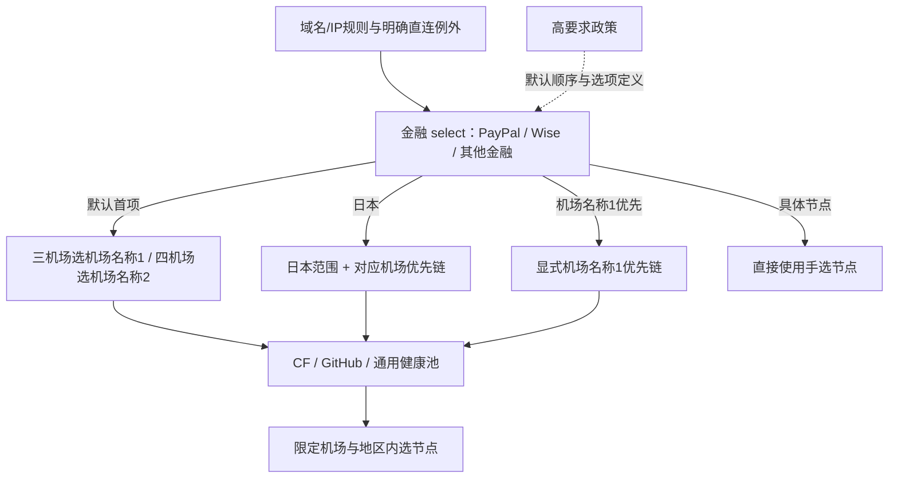

# 三/四机场独立配置：默认、业务选择与探针

使用支持rematch的官方Mihomo，固定验收版本为v1.19.30；旧v1.19.19实测无法解析该类型。CI使用最新稳定版及固定v1.19.30检查。

日期：2026-09-11。[三机场配置](../configfull_new.yaml)用于当前机场名称1、机场名称3、机场名称4；[四机场模板](../cinfigfull_new_4.yaml)另含机场名称2家宽。两份文件各自完整，每次只加载其中一份，无需合并或展开注释。三机场已提升为主配置；[configfull.bak.yaml](../configfull.bak.yaml)保存此次获取的远程原版，设备运行配置尚未切换；验收见[审计记录](config-optimization-audit.md)。

## 1. 三个维度各自负责什么

| 维度 | 职责 | 如何复用 |
|---|---|---|
| 四层政策 | 默认机场顺序、自动回退边界与候选范围 | 四个内部YAML锚点；通过选项首项表达默认，不另设层级自动入口 |
| 业务select与链路选项 | 用户为本业务选择默认链路、机场偏好、地区或具体节点 | 同层业务复用选项定义，各自保存选择 |
| 探针节点池 | 在已确定范围内判断健康与测速择优 | 机场×地区×探针池共享，不按业务复制 |

金融业务属于高要求层，同时拥有独立的“金融”select。PayPal、Wise等规则进入金融组；金融组选择的链路统一控制这些已归入该组的请求。CF身份不会另开一个用户选择入口，也不会改变金融的等级。

高要求、普通、成本仅用于配置内部分层。菜单直接显示机场偏好和地区，不再同时提供行为相同的“高要求-自动”和“机场名称1优先-自动”。主规则只决定一次业务归属。业务选择自动链路后，由官方[rematch](https://wiki.metacubex.one/config/proxies/rematch/)进入对应子规则，按探针家族选择终结候选池；选择具体节点或DIRECT直接使用该选择。子规则不返回业务选择器，不依赖请求标记或外部同步脚本。

## 2. 四层政策

| 内部层级 | 三机场文件 | 四机场文件 | 边界 |
|---|---|---|---|
| 最高要求 | 默认机场名称1日本手选池 | 默认相同 | 默认不自动换路；用户可覆盖为其他链路 |
| 高要求 | 1→3→4 | 2→1→3→4 | 自动先在本机场按地区顺序回退，再跨机场 |
| 普通 | 1→3→4 | 1→2→3→4 | 同上，家宽的优先位置不同 |
| 成本 | 3→1→4 | 3→1→2→4 | 同上，优先成本机场 |

每个业务的第一项表达其默认策略；其他机场偏好是可选覆盖，不额外显示“遵循业务默认”。指定地区只收窄地区，保留该业务对应的机场顺序。三机场高要求与普通共用同一选项定义；四机场高要求默认机场名称2。AI默认保持日本手选，但用户可主动选择机场自动、地区、共享家宽、DIRECT或其他机场实际节点；主动选择自动链后遵从该链回退。

机场名称1：日本→香港→新加坡→美国。按用户对国际服务地区适用范围的偏好采用日本默认；[港日新实测](region-priority-comparison.md)仍显示香港建连更快，没有证明日本更稳定。通用、GitHub、CF三类链使用同一地区顺序，各自在地区内测速。四机场文件中的机场名称2仍为香港→日本→新加坡→美国，未来家宽未实测。机场名称3：日本→新加坡→香港→美国。机场名称4普通备用：香港→日本→新加坡→美国→台湾→欧洲→未知地区。同地区的主要节点池使用url-test，50ms容差；机场间与地区间由fallback执行规定顺序。地区和IP稳定均是尽力而为，不是固定出口承诺。

回退依据各组当前健康状态。HTTP订阅冷启动和多层检查传播期间可能暂用较低优先候选；本地故障验收曾观察到短暂跨机场后才回到同机场下一地区。指定地区仍限制候选范围，但不能把默认地区顺序理解为无过渡跳转的承诺。另有一次冷启动异常尚未定位，记录见验收文档。

## 3. 业务入口与归属

按实际用途和已查证的限制聚合。用户已确认影音以普通播放为主、游戏以下载和日常游玩为主；Netflix等有明确代理限制的服务保持独立，普通业务在同类集合内共用选择。独立入口与政策等级分别判断：TikTok、TVB有地区操作价值，但不据此认定需要高信誉IP。资料、判断与限制见[分组依据](business-grouping-rationale.md)。

当前共32个可见select。下表同一行列出的每个入口各自保存选择；“范围”列的成员共用该入口的一次手选。

| 入口 | 政策 | 范围 |
|---|---|---|
| Cloudflare Tunnel | 传输专用，默认DIRECT | 全球Tunnel端点的TCP/UDP 7844；独立选择直连、自动链或节点 |
| AI | 最高要求 | AI集合、OpenCode、Copilot精确例外 |
| 金融 | 高要求 | PayPal、Wise、境外金融、加密资产 |
| Talkatone | 高要求 | 沿用已确定的独立要求，不宣称官方强制美国或家宽 |
| NETFLIX、DisneyPlus、HBO、Primevideo、Spotify | 高要求，各自独立 | 前四项有播放代理限制；Spotify有账号请求的VPN/Proxy拒绝说明 |
| Reddit | 高要求 | 原reddit_domain；网络与位置参与账号质量评分，升层是保守设计判断 |
| Google | 普通 | Google、GoogleVPN、FCM |
| Microsoft | 成本 | Microsoft、OneDrive |
| 境外通信 | 成本 | Telegram、LINE、Discord、Signal及原通信集合 |
| 境外社媒 | 普通 | Meta及原社媒集合；Reddit和TikTok先进入各自入口 |
| TikTok | 普通 | 独立地区选择；SIM/IP地区信号不等于家宽要求 |
| TVB | 普通 | 原TVB_domain及mytv.com.hk；集合混有港澳及海外产品，保留地区手选，不整组锁香港 |
| 哔哩东南亚 | 普通 | 按用户要求保持独立 |
| 境外电商 | 普通 | 原Amazon电商和境外电商集合；与金融保持不同控制范围 |
| 境外影音 | 成本 | YouTube、AppleTV常规播放，以及原Twitch/其他影音；TVB移出 |
| 开发下载 | 成本 | HuggingFace、Docker、GitHub/GitBook、原开发下载及Google源码/下载主机 |
| 纯下载 | 成本＋特殊算法 | release-assets.githubusercontent.com与codeload.github.com，保留实测支持的独立传输选路 |
| 游戏平台 | 成本 | Steam、Epic、EA、Blizzard、UBI、Sony、Nintendo；按用户确认的下载和游玩用途合并 |
| Kryptex、Speedtest | 成本，各自独立 | 按用户要求保留特殊业务 |
| 通用代理 | 成本 | 原“节点选择”的香港电视例外、Linux DO、人工代理及剩余流量 |
| 台湾限定 | 普通＋台湾范围 | Bahamut，仅台湾自动或台湾实际节点 |
| Emby | 成本＋特殊默认 | 按用户要求独立，默认低倍率/MITM手选池 |
| Apple、哔哩哔哩 | DIRECT默认，各自独立 | 保持原直连业务分别调整的能力 |
| 隐私拦截 | 工具 | REJECT、REJECT-DROP、DIRECT、通用代理 |
| 自建/家宽节点 | 共享手选 | 按原配置名称关键词筛选；只包含实际节点，空池REJECT |
| GLOBAL | 工具 | 通用机场名称3优先、机场名称1优先、自建/家宽节点、港/日/新/台/美成本地区自动、DIRECT及实际节点 |

此前聚合合并13个旧入口，新增TVB、Reddit两个有证据支持的独立入口：41→30个可见select；三机场文件：120→109组，四机场文件：155→144组。此次继续删除重复自动别名，三机场rematch从20减到12、子规则14减到12，四机场rematch从20减到18、子规则19减到18；拆分时109/144个策略组和原节点池不变，未增加按品牌复制的探针池。随后Tunnel优化新增1个手选入口，当时三/四机场分别110/145组、31个可见select。此次恢复自建/家宽快捷手选后为111/146组、32个可见select；主规则131条、规则provider93个。

业务select未设置自动检查周期。已有provider、URL和过滤范围继续复用，依据官方v1.19.30的[组解析](https://raw.githubusercontent.com/MetaCubeX/mihomo/v1.19.30/adapter/outboundgroup/parser.go)和[健康检查实现](https://raw.githubusercontent.com/MetaCubeX/mihomo/v1.19.30/adapter/provider/healthcheck.go)，不另建每业务定时测速任务；手动点测速属于额外操作。

默认层级沿用此前复评：Microsoft与境外通信完整入口采用成本政策，Telegram和OneDrive恢复原机场名称3优先；Microsoft主体、LINE/Discord/Signal及原通信集合则由普通转成本。Google保留普通，依据是搜索明确受共享出口异常流量影响，FCM随整组选择；不宣称机场名称1已经实测更少验证码或推送更可靠。AppleTV及原境外影音中留下的Twitch/其他影音也从普通改成本。五个严格媒体从普通升高要求，Reddit从普通社媒拆出高要求；三机场顺序相同，四机场文件才体现2→1与1→2的差异。本次拆分没有再次改变业务默认机场顺序。

归属以主规则先后为准。例如Copilot精确例外先进入AI，国内Steam CDN保留DIRECT；共享CDN及人工例外不按表中平台名称强行归类。金融规则集较宽，本轮保持原金融集合及明确直连例外，不推断所有成员的账号使用要求。

金融默认执行高要求政策。删除PayPal专用选择器和日本特供链；旧PayPal默认日本不再独立生效，也不扩大为全部金融默认日本。需要该偏好时，三机场金融选择“日本·机场名称1优先”，四机场金融选择“日本·机场名称2优先”。

## 4. 业务可以选择哪些链路

| 入口 | 可选项（机场偏好在配置中保留“-自动”后缀） |
|---|---|
| Cloudflare Tunnel | DIRECT（默认），以及成本业务的机场自动、地区、共享家宽和全部实际节点选项 |
| AI | AI日本手选池（默认），以及普通业务的机场自动、地区、共享家宽、DIRECT和全部实际节点；四机场另可选机场名称2优先 |
| 三机场高要求/普通业务、四机场普通业务 | 机场名称1优先（默认）、机场名称3优先、港/日/新/台/美·机场名称1优先、自建/家宽节点、全部实际节点、DIRECT |
| 四机场高要求业务 | 机场名称2优先（默认）、机场名称1优先、机场名称3优先、港/日/新/台/美·机场名称2优先、自建/家宽节点、全部实际节点、DIRECT |
| 成本业务（两文件） | 机场名称3优先（默认）、机场名称1优先、港/日/新/台/美·机场名称3优先、自建/家宽节点、全部实际节点、DIRECT |
| 台湾限定 | 台湾·机场名称1优先、实际台湾节点 |
| Emby | 低倍率/MITM手选池（默认），以及成本业务选项 |
| Apple、哔哩哔哩 | 各自默认DIRECT，以及成本业务选项 |

“日本·机场名称1优先”限制日本候选，再按三机场文件：1→3→4或四机场文件：1→2→3→4回退；“日本·机场名称3优先”对应3→1→4或3→1→2→4。四机场高要求的“日本·机场名称2优先”对应2→1→3→4。这些路径无共享手选状态，名称中的“优先”不表示只允许一个机场。

取消共享“日本节点”等可变中间select。金融改选日本范围或某个具体日本节点，不会改动Google、Talkatone或开发下载的选择。Netflix与Disney分别选择不同地区或节点，也互不改动。聚合后成员共同服从所属入口的选择：修改境外影音会同时作用于YouTube与AppleTV，修改开发下载会同时作用于HuggingFace与Docker。具体节点在各业务直接手选；欧洲继续手选实际节点，不把整个欧洲当作一个国家建立自动回退。AI日本和Emby低倍率手选子池各自只服务一个业务。

恢复“自建/家宽节点”作为明确的共享手选例外：先在该组选择实际节点，再让需要它的业务选择此入口；以后只改该组，所有引用它的业务对后续连接共同生效。AI、Tunnel、普通、高要求、成本、默认直连业务、Emby和GLOBAL均提供此选项，默认顺序不变。规则模式不会强制覆盖其他业务或明确直连；全局模式可在GLOBAL直接选择它。台湾限定继续保持原有台湾候选范围。AI和Tunnel的共享组选择是用户主动覆盖，修改共享节点会同时改变其后续出口。

筛选沿用原配置的自建、家宽、home、private、Self_Back、CF及运营商名称等关键词，只是查找快捷方式，不认证真实家宽或IP信誉；未匹配的节点仍可直接手选。该组没有自动地区或机场回退，节点失败不会擅自换路，筛空后REJECT。组内节点和业务引用均由store-selected保存；共享选择变化不保证已有连接立即迁移。

按已确认的取舍，继续不提供“只用机场名称1日本、区内自动换节点”这样的机场与地区组合选项；地区自动仍按所属层跨机场回退。

隐私拦截选择“通用代理”后，命中拦截规则的请求按通用代理当前选择放行；其他明确直连规则仍按原顺序生效。GLOBAL的地区选项直接复用通用探针的地区成本fallback，三机场文件：3→1→4，四机场文件：3→1→2→4；全局模式不再按业务或CF/GitHub家族分流。

临时全局使用单个节点：在GLOBAL中选择该实际节点，再把核心模式从rule改为global。此时经核心接管的普通请求统一使用该节点，不再执行主规则的业务、直连和拦截分流；无需逐个修改业务。只修改GLOBAL而保持rule模式不会产生全局覆盖。结束后切回rule，各业务继续使用自己保存的选择。GLOBAL也可选择共享家宽组；节点选择保存与运行模式切换是两回事，不承诺通过API临时修改的模式在重启后保留。

用户手选具体节点后，该业务的CF/GitHub/通用请求使用同一节点，探针失败不擅自改选。自动模式下不同探针池可能选出不同实际节点；确定的是政策与候选边界，不承诺跨探针同IP。修改选择针对后续连接，不保证已有连接立即迁移。

## 5. 探针与特殊算法

| 家族 | URL | 状态 |
|---|---|---:|
| 通用 | https://www.gstatic.com/generate_204 | 204 |
| GitHub | https://codeload.github.com/_ping | 200 |
| CF | https://cp.cloudflare.com/generate_204 | 204 |

在自动链路内，已识别CF请求用CF探针链，其次GitHub集合用GitHub探针链，其他请求用通用链。各探针不能越过用户所选地区和机场顺序。域名集合识别承载家族，不实时发现所有CDN；204也不证明IP信誉、账号风控或完整源站服务。

CF范围沿用上游cloudflare_domain与八项有证据的内联域名：unpkg.com后缀，以及cdnjs.com、api.cdnjs.com、nodejs.org、linux.do、cdn.linux.do、connect.linux.do、discord.com精确主机。不按共享IP/ASN整段接管，不扩大多CDN站点父域。依据见上一轮审计材料与官方说明：[UNPKG](https://unpkg.com/#cache-performance)、[cdnjs](https://github.com/cdnjs/api-server/blob/master/package.json)、[Node.js](https://nodejs.org/en/blog/announcements/making-nodejs-downloads-reliable)、[Linux DO](https://linux.do/t/topic/198278)、[CDN](https://linux.do/t/topic/125306)、[OAuth日志](https://linux.do/t/topic/855291)、[Discord](https://docs.discord.com/developers/reference)。

`pure_download_domain`仅含release-assets.githubusercontent.com与codeload.github.com，统一进入独立的纯下载select。其默认成本链允许机场名称1、机场名称3及未来机场名称2在港日新美测速择优；机场名称4保留全部候选测速兜底。其他GitHub业务保持地区顺序。纯下载手选地区后使用该地区GitHub池；手选节点后固定使用该节点。开发下载与纯下载各自保存选择，互不改变出口。保留url-test，不添加load-balance。

Docker镜像R2主机`docker-images-prod.6aa30f8b08e16409b46e0173d6de2f56.r2.cloudflarestorage.com`保留精确规则归开发下载，与其他Docker下载条件共用该入口选择；其CF身份交给所选自动路径判断；不扩大到整个R2父域。

Cloudflare Tunnel单独控制被穿透端到边缘的TCP/UDP 7844，限五个精确域名及官方全球40个端点IP。域名与IP共用一次选择，默认DIRECT；可主动选现有机场自动链、地区链、共享家宽或实际节点。选择不支持UDP的节点时拒绝该UDP流量，避免规则继续下落成直连。普通CF网页、443及trycloudflare.com保持原策略；自动选项复用现有网页探针，未证明能代表Tunnel的7844/QUIC状态；用户可自行权衡，默认仍为实测支持的DIRECT。真机握手复测支持继续保留DIRECT默认。两个region域名精确使用real-ip，argotunnel.com的发现查询使用国内DIRECT DNS，避免每个地址池被压缩成一个Fake-IP。候选已修复，生产四条连接恢复仍需上线验证。数据与边界见[Tunnel上行研究](cloudflare-tunnel-uplink.md)。

## 6. 独立文件与换版边界

明确DIRECT、国内白名单、cn_domain及剩余流量cn_ip兜底继续优先；CF身份不能覆盖这些决定。原广告层次、自定义例外、香港电视及跨区产品的规则先后不变，cn_ip没有整体提前到已确定业务之前。

两份配置的DNS、TUN、嗅探、规则、节点过滤和检查周期一致。三机场没有Airport_02或注释中的四机场代码；四机场文件的Airport_02及对应链路已完整写入，实际使用前填写真实家宽订阅及自己的连接参数。机场名称2目前不存在，拆出模板不代表已接入。规则更新分别使用GitHub机场名称3→1→4→DIRECT和3→1→2→4→DIRECT；GLOBAL继续使用可直接拨号的链。

两文件分别编辑和加载，运行无需生成器或共享基础文件。公共规则/系统参数的修改应同步两份，设计检查核对公共字段，避免两个模板逐渐分叉。四机场文件切换是显式操作；当前三机场文件不会因以后新增家宽而自行改变默认。若沿用缓存，高要求业务中已有的“机场名称1优先-自动”仍有效，会继续保留；要使用四机场的家宽默认，需主动选择“机场名称2优先-自动”。

统一命名为`机场名称1`至`机场名称4`，链路入口、隐藏池、子规则及其引用使用相同写法，provider标识`Airport_01`等与节点前缀`[机场名称1]`等保持原样。

`store-selected`继续保留同名业务中的有效选择，但内核不会把旧名称映射为新名称。本次机场偏好、地区选项和AI日本手选子池均已改名；首次加载后，应核对这些选择及AI子池内的手选节点，旧名称失效可能回到默认项。实际节点名称及Emby专属子池未变，仍有效的选择继续保留。不清空缓存或增加兼容菜单；按新名称重新选择后，正常重启仍会恢复。

## 7. 验收契约

- 同类普通业务按已确认用途聚合；明确代理限制、地区操作差异和既定特殊业务保留独立入口。依据与未验证范围单独记录。
- 严格媒体、Reddit与普通聚合组分别手选并跨重启恢复；同一聚合入口的所有成员共同受控；纯下载继续独立于开发下载。
- 业务选地区后保留所属层机场顺序；所有探针和下载均不越区。
- 默认、显式机场偏好、具体节点各自语义清楚；最高要求默认保持手选，用户主动覆盖后遵从所选链路。
- 主规则条件与顺序、明确直连保持；业务合并、拆分和默认层级变化均列出证据与代价。
- 三/四机场实际文件分别原生加载、TCP/UDP、重启缓存、订阅更新和GLOBAL验证，测试不再从注释生成配置。
- 隐私拦截可经通用代理放行；GLOBAL地区自动不越区且不引用rematch。
- 不以减少菜单数代替正确性；不声称本地夹具证明真实账号风控、公网UDP/QUIC、实际TUN或耗电。
